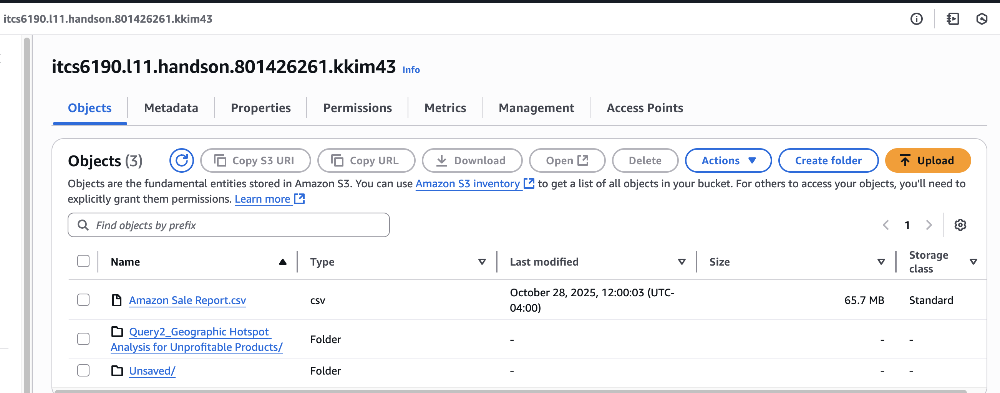
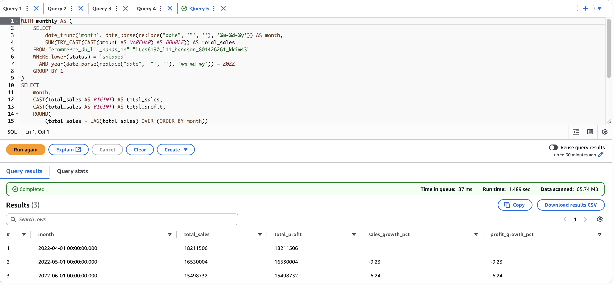

# 2025 ITCS6190 Hands-on L11 (AWS)

**Name(ID):** Kiyoung Kim (801426261)  
**E-Mail:** kkim43@charlotte.edu

**Dataset:** [Unlock Profits with E-Commerce Sales Data (Kaggle)](https://www.kaggle.com/datasets/thedevastator/unlock-profits-with-e-commerce-sales-data)

---

## Overview
This hands-on project shows how to use key AWS services for simple data analysis.

Steps followed:
1. Upload the raw CSV file to **Amazon S3**
2. Create an **IAM Role** that allows access to S3 and Glue
3. Set up and run a **Glue Crawler** to read the S3 data
4. Use **CloudWatch** to check the crawler logs and status
5. Use **Athena** to query the data and save the results as CSV files

---

## Queries and Results

---

### Query 1 – Cumulative Sales Over Time (2022)

**Purpose:**  
To calculate the running total of sales (Amount) for each day in 2022.

**SQL Query:**
SELECT
    "date" AS order_date,
    SUM(CAST(amount AS DOUBLE))
        OVER (ORDER BY date_parse(replace("date", '"', ''), '%m-%d-%y')
        ROWS BETWEEN UNBOUNDED PRECEDING AND CURRENT ROW) AS cumulative_sales
FROM "ecommerce_db_l11_hands_on"."itcs6190_l11_handson_801426261_kkim43"
WHERE year(date_parse(replace("date", '"', ''), '%m-%d-%y')) = 2022
ORDER BY order_date
LIMIT 10;

**Result Preview:**

order_date | cumulative_sales  
------------|------------------  
04-30-22 | 2.84E7  
04-30-22 | 2.84E7  
04-30-22 | 2.84E7  
... | ...

---

### Query 2 – State-wise Unprofitable Orders

**Purpose:**  
To find which states have the highest total losses (based on cancelled orders).

**SQL Query:**
SELECT
    "ship-state" AS state,
    ROUND(SUM(CAST(amount AS DOUBLE)), 2) AS total_loss_amount
FROM "ecommerce_db_l11_hands_on"."itcs6190_l11_handson_801426261_kkim43"
WHERE lower(status) = 'cancelled'
GROUP BY "ship-state"
ORDER BY total_loss_amount DESC
LIMIT 10;

**Result Preview:**

state | total_loss_amount  
-------|------------------  
MAHARASHTRA | 1,098,378.88  
KARNATAKA | 827,075.43  
UTTAR PRADESH | 625,327.70  
... | ...

---

### Query 3 – Average Order Value by Category and Status

**Purpose:**  
To compare average order values across product categories and order statuses (shipped, cancelled, pending).

**SQL Query:**
WITH cleaned AS (
  SELECT
    category AS sub_category,
    CASE
      WHEN lower(status) LIKE 'cancelled%' THEN 'cancelled'
      WHEN lower(status) LIKE 'shipped%'  THEN 'shipped'
      WHEN lower(status) LIKE 'pending%'  THEN 'pending'
      ELSE regexp_replace(lower(status), '\\s+', ' ')
    END AS order_status,
    TRY_CAST(CAST(amount AS VARCHAR) AS DOUBLE) AS amount_num
  FROM "ecommerce_db_l11_hands_on"."itcs6190_l11_handson_801426261_kkim43"
)
SELECT
  sub_category,
  order_status,
  ROUND(AVG(amount_num), 2) AS avg_order_value,
  COUNT(amount_num) AS order_count
FROM cleaned
WHERE amount_num IS NOT NULL
GROUP BY 1, 2
ORDER BY sub_category ASC, avg_order_value DESC
LIMIT 10;

**Result Preview:**

sub_category | order_status | avg_order_value | order_count  
--------------|---------------|----------------|--------------  
Blouse | pending | 541.75 | 4  
Blouse | cancelled | 533.59 | 75  
Blouse | shipped | 518.98 | 802  
... | ... | ... | ...

---

### Query 4 – Top 3 Products by Sales in Each Category

**Purpose:**  
To identify the top 3 best-selling products in each category.

**SQL Query:**
WITH ranked AS (
  SELECT
    category,
    style AS product_name,
    SUM(CAST(amount AS DOUBLE)) AS total_sales,
    RANK() OVER (PARTITION BY category ORDER BY SUM(CAST(amount AS DOUBLE)) DESC) AS rank_in_category
  FROM "ecommerce_db_l11_hands_on"."itcs6190_l11_handson_801426261_kkim43"
  WHERE lower(status) = 'shipped'
  GROUP BY category, style
)
SELECT category, product_name, total_sales, rank_in_category
FROM ranked
WHERE rank_in_category <= 3
ORDER BY category ASC, total_sales DESC
LIMIT 10;

**Result Preview:**

category | product_name | total_sales | rank_in_category  
----------|---------------|--------------|------------------  
Blouse | J0217 | 62440.0 | 1  
Blouse | J0219 | 43169.0 | 2  
Blouse | J0216 | 38631.0 | 3  
... | ... | ... | ...

---

### Query 5 – Monthly Sales and Growth (Apr–Jun 2022)

**Purpose:**  
To analyze monthly sales totals and their month-to-month growth rates for 2022.

**SQL Query:**
WITH monthly AS (
  SELECT
    date_trunc('month', date_parse(replace("date", '"', ''), '%m-%d-%y')) AS month,
    SUM(TRY_CAST(CAST(amount AS VARCHAR) AS DOUBLE)) AS total_sales
  FROM "ecommerce_db_l11_hands_on"."itcs6190_l11_handson_801426261_kkim43"
  WHERE lower(status) = 'shipped'
    AND year(date_parse(replace("date", '"', ''), '%m-%d-%y')) = 2022
  GROUP BY 1
)
SELECT
  month,
  CAST(total_sales AS BIGINT) AS total_sales,
  CAST(total_sales AS BIGINT) AS total_profit,
  ROUND((total_sales - LAG(total_sales) OVER (ORDER BY month)) / NULLIF(LAG(total_sales) OVER (ORDER BY month), 0) * 100, 2) AS sales_growth_pct,
  ROUND((total_sales - LAG(total_sales) OVER (ORDER BY month)) / NULLIF(LAG(total_sales) OVER (ORDER BY month), 0) * 100, 2) AS profit_growth_pct
FROM monthly
WHERE month >= DATE '2022-04-01'
ORDER BY month
LIMIT 10;

**Result Preview:**

month | total_sales | sales_growth_pct  
-------|--------------|----------------  
2022-04-01 | 18211506 | –  
2022-05-01 | 16530004 | –9.23  
2022-06-01 | 15498732 | –6.24  

---

## Screenshots

**Figure 1.** Uploaded dataset in the S3 bucket  

**Figure 2.** IAM Role with S3 and Glue permissions  

**Figure 3.** Glue Crawler logs in CloudWatch (completed successfully)  

**Figure 4.** Athena query editor showing results  

---

## Notes
- The dataset only covers **April to June 2022**, so the monthly analysis shows 3 months of data.  
- There is no profit column in the dataset, so `Amount` was used instead.  
- All SQL queries were tested and executed successfully in **AWS Athena**.  
- Each query result was downloaded as a CSV file for submission.
